# Plan de implementación final

**SAVE Documentos · SA&VE Comercial, S.R.L. — Punta Cana**
Consolida el plan anterior y los hallazgos de `SAVE-AUDITORIA-INTEGRAL.md`.
5 de septiembre de 2026 · Sustituye a `11-PLAN-DE-IMPLEMENTACION.md`

---

## La idea que ordena todo el plan

El producto funciona. Lo que falta está alrededor. Y hay **dos relojes distintos** que conviene no confundir:

- **Tiempo de abogada:** revisar 123 cláusulas y 251 plantillas. No se acelera escribiendo código, no se puede delegar y es lo más largo de todo el plan.
- **Tiempo de desarrollo:** todo lo demás.

**Corren en paralelo.** El error caro sería tratarlos como una secuencia y quedarse esperando. Mientras la revisión legal avanza, el desarrollo tiene semanas de trabajo útil por delante — y una de esas piezas, la importación de documentos, es precisamente la que hace que el producto sirva **mientras** el catálogo sigue sin aprobarse.

```mermaid
flowchart LR
  F0["F0 · Cerrar lo abierto"] --> F1["F1 · Bloqueos de uso"]
  F0 --> F2["F2 · REVISIÓN LEGAL<br/>123 cláusulas → 251 plantillas"]
  F1 --> F3["F3 · Importar y convertir<br/>en plantilla"]
  F1 --> F4["F4 · Visibilidad nueva"]
  F1 --> F5["F5 · Confianza y conversión"]
  F2 --> F6["F6 · Arquitectura SEO"]
  F5 --> F6
  F6 --> F7["F7 · Analítica"]
  F3 --> F8["F8 · Rendimiento y accesibilidad"]
  F4 --> F8
  F7 --> F9["F9 · Cobros CardNET"]
  F8 --> F9
```



**El camino crítico hacia la adquisición orgánica es F2 → F6 → F7.** Todo lo demás puede adelantarse o retrasarse sin mover esa fecha.

---

## Los tres planes

Decidido el 5 de septiembre. Cierra D1, D2 y D4.

| | **Gratis** | **Pro** · RD$999/mes | **Equipo** · RD$1,699/mes |
|---|---|---|---|
| Plantillas del catálogo | 50 | Las 251 | Las 251 |
| Documentos al mes | 5 | 30 | Sin tope |
| Bóveda | 10 | 30 | 100, y +30 por integrante adicional |
| Crear plantilla desde un documento | — | Sí | Sí |
| Despacho con equipo | — | — | Sí |
| Usuarios | 1 | 1 | Titular + 2 incluidos |
| Usuario adicional | — | — | RD$399/mes |

**Cómo se cuenta la bóveda de Equipo.** Los 100 ya cubren al titular y a los dos
incluidos. El cuarto integrante sube el tope a 130, el quinto a 160, y así.
La bóveda se cuenta **por despacho, no por persona** — y eso ahorra trabajo real:
los archivos ya se guardan en `{org_id}/`, así que no hay que cambiar la
convención de rutas ni mover nada de lo subido.

**Las 50 plantillas del plan gratis** se calculan solas: las más usadas por número
de documentos generados, recalculadas cada semana. **Con una salvedad para el
arranque**, porque hoy hay cero documentos generados y un ranking sin datos sale
vacío: mientras una plantilla no tenga uso, el desempate es por categoría, las
mejores de cada una de las once en rotación. Así el escaparate gratuito cubre
todas las categorías desde el primer día en vez de ser cincuenta contratos de
vehículos, y en cuanto haya uso real el ranking lo corrige solo.

**La asimetría de los dos defaults, que es deliberada:**

- **Documentos:** todo el despacho los ve, salvo que el autor los marque privados.
- **Bóveda:** nadie los ve, salvo que el autor los marque visibles para el despacho.

Son defaults opuestos a propósito. La bóveda es el archivo de originales
sensibles —cédulas, títulos, poderes firmados—; los documentos son el trabajo en
curso del despacho. Hay que **contárselo así al usuario** en la interfaz: si no,
alguien subirá algo dando por hecho que se comporta como lo otro.

**Y lo que hay que saber antes de estimar nada:** hoy **ningún límite se aplica**.
`free_limit` y `vault_limit` existen en la tabla y se pintan en pantalla, pero
solo la bóveda comprueba el suyo. No hay tope de documentos de ninguna clase, ni
control de qué plantillas ve cada plan. Los tres planes se implementan desde
cero; no es ajustar números existentes.

---

## Cómo se lee cada tarea

Cada una lleva **qué**, **por qué**, **dónde** y **cuándo está hecha**. Ese último campo es el que importa: una tarea no está hecha porque exista el código, sino porque se comprobó que hace lo que decía. Los tiempos son estimaciones gruesas de una persona desarrollando.

---

# FASE 0 · Cerrar lo abierto

> ## ✅ CERRADA · 5 de septiembre de 2026
>
> Las tres tareas hechas y comprobadas. Con esto **no queda ningún problema
> crítico abierto** en el proyecto.

**Lo que costó de verdad:** una hora, más un fallo que apareció por el camino
y que merece quedar escrito (ver 0.2).

### 0.1 Rotar las dos credenciales expuestas · P0 · 👤

**Qué.** Cambiar la contraseña del buzón de Hostinger y la contraseña de aplicación, y reescribir la configuración SMTP completa en Supabase.

**Por qué.** Las dos quedaron en texto plano durante el proyecto. Es el único riesgo de seguridad realmente abierto.

**Ojo con esto:** un PATCH parcial a `/config/auth` de Supabase **borra** el campo en vez de actualizarlo. Hay que reenviar el bloque entero. `scripts/configurar-smtp-supabase.ps1` ya lo hace bien.

**Hecho cuando:** un registro de prueba recibe su correo de confirmación con las credenciales nuevas.

**✅ Hecho el 5 de septiembre.** Credenciales rotadas y SMTP funcionando.

### 0.2 Verificar robots.txt y sitemap.xml en el dominio

**Qué.** Comprobar que los dos responden 200 en producción.

**Por qué.** Se generan en el build. Existen en el repositorio, pero eso no es lo mismo que existir en el dominio.

**Hecho cuando:** `savedocumentos.com/robots.txt` menciona el sitemap y `savedocumentos.com/sitemap.xml` contiene la portada.

**✅ Hecho el 5 de septiembre — y aquí apareció un fallo que valida la tarea.**

Los dos seguían devolviendo 404 **con el código ya subido a origin**. No era
falta de despliegue: `/login` tampoco traía el `noindex` del mismo commit, lo
que descartaba a Railway y señalaba al build.

La causa: `robots.ts` y `sitemap.ts` importaban `getSiteUrlEstatico` desde
`lib/siteUrl.ts`, y ese archivo empieza con `import { headers } from 'next/headers'`.
Los dos son **rutas estáticas** —Next las genera en el build, cuando no existe
ninguna petición que tenga cabeceras—, así que arrastrar `next/headers`, aunque
sea de rebote, las rompe. La versión sin cabeceras se mudó a `lib/dominio.ts`,
que no importa nada de Next.

**La lección, que es el motivo de que esta tarea exista:** el código estaba
escrito, revisado y subido, y no estaba hecho. Sin comprobarlo contra el dominio
habríamos dado por buenos dos archivos que no existían.

### 0.3 Cerrar la prueba de privacidad de documentos

**Qué.** Quitar el compartir del documento de prueba y recargar como paralegal.

**Por qué.** Es lo único del modelo de privacidad que está verificado sobre PostgreSQL pero no en producción. Con un solo documento compartido, ver uno no demuestra nada.

**Hecho cuando:** el documento desaparece de la lista del paralegal.

**✅ Hecho el 5 de septiembre.** Quitado el compartir, el paralegal —dentro del
mismo despacho, con la cabecera diciendo "Despacho de elianastephania…"— pasó a
ver **cero documentos**. El documento existe y es del despacho; no lo ve porque
nadie se lo compartió. Privacidad probada por los dos lados.

> Esta prueba pierde sentido cuando entre F4, que invierte el modelo. **Hacerla antes.**

---

# FASE 1 · Bloqueos de uso

> ## ✅ CERRADA · 5 de septiembre de 2026
>
> Las seis tareas hechas. Queda solo 1.7, que es P3 y se hará junto con 8.1
> porque tocan el mismo archivo.
>
> **Verificado en producción con sesión iniciada:** el menú móvil se abre a
> 606 px, atrapa el foco, bloquea el scroll de fondo y muestra solo las seis
> secciones que le tocan a un paralegal. El panel ya lee del plan:
> *"Plan Equipo: sin tope"* y bóveda *"0 / 100"*, que es la fórmula
> funcionando con un despacho de dos integrantes.

### 1.1 Menú de navegación en móvil · P1

**Qué.** Menú hamburguesa para el área privada por debajo de 768 px.

**Por qué.** El `<aside>` es `hidden md:block`: en un teléfono **desaparece y no hay sustituto**. Quien entre a `/app/documents` no puede llegar a Plantillas, Bóveda ni Mi Despacho salvo escribiendo la URL a mano.

**Dónde.** `src/app/app/layout.tsx`, `src/components/ui/AppNav.tsx`

**Hecho cuando:** a 375 px se puede llegar a las seis secciones sin tocar la barra de direcciones.

**✅ Hecho.** `AppNav` pasa a exportar la lista de enlaces y el menú móvil usa esa misma: si cada uno tuviera la suya, una sección nueva aparecería en uno y no en el otro.

### 1.2 Buscador y paginación en Plantillas · P2

**Qué.** Campo de búsqueda por título y categoría, y paginación o carga progresiva.

**Por qué.** 251 tarjetas de golpe son 7.147 nodos en el árbol. En un teléfono pesa, y encontrar una plantilla concreta obliga a recorrerlas todas. `ClausesClient` ya tiene un buscador que sirve de modelo.

**Dónde.** `src/app/app/templates/TemplatesClient.tsx`

**Hecho cuando:** escribir "alquiler" deja a la vista solo las de alquiler, y la página monta menos de 2.000 nodos.

**✅ Hecho.** Búsqueda por nombre, categoría y descripción, filtro por categoría y tandas de 24. Las categorías del filtro salen de lo que hay en la lista, no de una escrita a mano — una fija se habría quedado desfasada, como ya pasó con las diez de la portada frente a las once de la base.

### 1.3 Aplicar los tres planes · P1

**Qué.** Que los límites de la tabla de arriba se cumplan de verdad.

**Por qué.** Hoy no se aplica ninguno salvo el de la bóveda. Un despacho en
Equipo pagando RD$1,699 tiene exactamente las mismas restricciones que uno
gratuito: ninguna.

**Las cuatro piezas:**

1. **Tope mensual de documentos.** No hace falta columna nueva ni contador que
   mantener: se cuenta `documents` con `created_at >= date_trunc('month', now())`
   para ese despacho. Un contador guardado se desincroniza; una consulta, no.
2. **Cupo de bóveda por plan**, con la fórmula de Equipo: `100 + 30 × (integrantes − 3)`,
   con suelo en 100.
3. **Las 50 plantillas del gratis.** Columna `es_gratuita` en `templates`, mantenida
   por una función que se recalcula cada semana, y la política de lectura del
   catálogo la respeta.
4. **Importar solo desde Pro** (ver Fase 3).

**Dónde.** `src/lib/billing.ts`, migración sobre `organizations`, políticas de
`templates`, `src/app/app/documents/new/`, `src/app/app/vault/actions.ts`

**Hecho cuando:** una cuenta gratuita genera cinco documentos y el sexto se
detiene con un mensaje que explica por qué y qué hacer; y un despacho de cuatro
personas ve 130 de cupo en la bóveda, no 100.

**✅ Hecho.** Los números viven en la tabla `planes`, que leen tanto la aplicación como el trigger. El periodo de gracia se modela como *plan efectivo*: pasados los siete días rige `CANCELLED`, con 0 documentos y 0 de bóveda — y cero de bóveda no impide leer ni descargar, solo subir, que es exactamente "solo lectura" sin una línea de lógica especial.

### 1.4 La bóveda: privada por defecto · P1 · ✅ decidido

**Qué.** Cada archivo nace privado. Su dueño decide si lo hace visible para el
despacho.

**Por qué.** Hoy las políticas del bucket aíslan por `org_id` y nada más: **todos
los miembros ven todo lo que suba cualquiera**. No se nota porque está vacía; en
cuanto se suban archivos, sí.

**Lo que NO hay que hacer, y conviene dejarlo escrito:** no hay que cambiar la
convención de rutas. Al contarse por despacho y no por persona, `{org_id}/archivo`
sigue sirviendo. Se añade una columna de propiedad y visibilidad, y las políticas
la consultan. Media jornada menos de la que estaba estimada.

**Dónde.** `supabase/migrations/20260822000001_vault_storage_bucket.sql`,
`src/app/app/vault/`

**Hecho cuando:** un paralegal sube un archivo, su compañero no lo ve, y al
marcarlo visible aparece.

**✅ Hecho.** Con el titular como excepción, que obliga a cuidar el lenguaje: llamar "Privado" a secas a un archivo que su jefa sí ve sería prometer de más, así que en pantalla dice **"Solo tú y el titular"**.

### 1.5 Textos que contradicen al producto · P2

**Qué.** Corregir *"Debe tener ya una cuenta en Save Documentos"* en Mi Despacho.

**Por qué.** Desde la Fase 1 se puede invitar a alguien sin cuenta y la crea él. El texto dice lo contrario y hace que no se use una función que ya existe.

**Dónde.** `src/app/app/settings/SettingsClient.tsx`

**Hecho cuando:** el texto describe el comportamiento real.

**✅ Hecho.**

### 1.6 Pedir el nombre a quien llega invitado · P3

**Qué.** Que `/definir-password` pida nombre y apellido junto con la contraseña.

**Por qué.** Sin nombre, el botón de compartir dice *"Compartir con stephaniamontero84+prueba2@gmail.com"* en vez de *"Compartir con Juana Martínez"*, que es como se pidió.

**Dónde.** `src/app/definir-password/`

**Hecho cuando:** el panel de compartir muestra nombres.

**✅ Hecho.** Se pide al crear la contraseña, el único momento en que esa persona está obligada a pasar por una pantalla. Y se guarda *después* de la contraseña: si el nombre fallara ya puede entrar y lo arregla luego; al revés, un fallo la dejaría fuera de su cuenta por un dato cosmético.

### 1.7 `middleware.ts` → `proxy.ts` · P3

**Qué.** La migración de nombre que Next 16 pide. Aplazada desde la Fase 0 por decisión propia.

**Se hace junto con 8.1**, que toca el mismo archivo.

---

# FASE 2 · Revisión legal del catálogo

**El camino crítico. Tiempo de abogada, no de desarrollo. Estimado: 3 a 6 semanas.**

> **El orden no es negociable: primero las 123 cláusulas, después las 251 plantillas.** `quality.ts` impide publicar una plantilla maestra si alguna de sus cláusulas sigue en borrador. Al revés, las plantillas rebotan una por una.

### 2.1 Dar de alta a la abogada

**Qué.** Que `legalcifuentes@gmail.com` se registre.

**Por qué.** La migración `20260902000000` ya dejó su permiso apuntado por correo. El trigger enlaza la cuenta sola al registrarse.

**Hecho cuando:** entra y ve "Revisión" en el menú, con el contador en 0 de 251 y 0 de 123.

### 2.2 Aprobar las 123 cláusulas

**Qué.** Leer, corregir donde haga falta y aprobar. La pantalla permite editar el texto sin salir.

**Ritmo realista:** entre 15 y 30 al día sin que la calidad se resienta. Entre cinco y ocho jornadas.

**Hecho cuando:** el contador de cláusulas llega a 123.

### 2.3 Aprobar las 251 plantillas

**Qué.** Igual, ya sin bloqueantes de variables ni de cláusulas.

**Por qué importa el orden:** solo cuando 2.2 esté cerrada desaparece el bloqueante *"N cláusulas siguen en borrador"*.

**Hecho cuando:** el número de la portada deja de decir "estamos terminando de revisar el catálogo" y empieza a contar. Ese contador ya está puesto y sube solo.

### 2.4 Estado RECHAZADA · P2

**Qué.** Un estado para lo que la abogada descarta, con motivo.

**Por qué.** Hoy solo se usan DRAFT y PUBLISHED. Una plantilla mala se queda en borrador, **indistinguible de una que nadie ha mirado todavía**. Con 251 por revisar, esa diferencia se pierde enseguida.

**Cómo.** Usar `ARCHIVED`, que ya está en el enum, más una columna de motivo.

**Hecho cuando:** se puede rechazar con motivo y el rechazado no vuelve a aparecer en la cola.

### 2.5 Limpieza del catálogo · P3

- Renombrar `dia_pago` o `dias_pago`: significan cosas distintas y están a un carácter.
- Revisar *"Depósito de garantía"* y *"Depósito en garantía"*.
- Normalizar los saltos de línea: 8 retornos de carro por documento, herencia del CRLF de Windows.

---

# FASE 3 · Importar documentos y convertirlos en plantillas

**Estimado: 2 a 3 semanas. Va aquí por una razón concreta.**

Mientras la abogada revisa, un cliente nuevo entra y **ve un catálogo vacío**. Son semanas de producto inservible. Pero si puede subir el contrato que ya usa y convertirlo en plantilla, SAVE le sirve desde el primer día **sin depender de la revisión legal** — y además es la propuesta de valor que la propia portada anuncia: *"Cualquier documento que repitas puede volverse una plantilla."*

Hoy esa frase no es cierta. Esta fase la hace cierta.

### 3.1 Subir e interpretar el documento

**Qué.** Aceptar `.docx` y pegado de texto plano, y extraer el contenido.

**Cómo.** Un `.docx` es un ZIP con `word/document.xml` dentro. `jszip` ya está en el proyecto para exportar; sirve igual para leer. **Sin dependencias nuevas.**

**Dónde.** `src/lib/engine/import.ts` (nuevo)

**Hecho cuando:** se sube un contrato real y sale su texto con los párrafos separados.

### 3.2 Detectar candidatos a variable

**Qué.** Proponer qué partes del texto deberían ser variables.

**Qué buscar**, y aquí el motor dominicano que ya existe hace casi todo:
- Cédulas con el formato `000-0000000-0` → `validateCedula` ya las valida
- RNC → `validateRNC`
- Montos en RD$ o US$ → `montoALetras` ya sabe convertirlos
- Fechas
- Nombres en mayúsculas sostenidas, típicos de los comparecientes
- Cualquier texto que se repita idéntico tres veces o más

**El diseño que importa:** la detección **propone**, no decide. La persona confirma cada una, le pone nombre y elige si reutiliza una variable del diccionario de 100 que ya existe o crea una nueva. Un importador que decide solo produce plantillas que nadie entiende.

**Dónde.** `src/lib/engine/import.ts`, `src/lib/engine/dominican.ts` (reutilizar)

**Hecho cuando:** sobre un contrato de alquiler real, propone al menos las cédulas, el precio y las fechas, y ninguna propuesta falsa evidente.

### 3.3 Pantalla de conversión

**Qué.** El texto a la izquierda, las variables propuestas a la derecha, y confirmar una por una.

**Dónde.** `src/app/app/templates/importar/` (nuevo)

**Hecho cuando:** de un `.docx` sale una plantilla del despacho, con su formulario, y genera un documento correcto.

### 3.4 Enganchar con el diccionario existente

**Qué.** Que al confirmar una variable ofrezca primero las 100 que ya existen.

**Por qué.** Si cada importación crea `nombre_comprador`, `comprador_nombre` y `nombre_del_comprador`, el diccionario se vuelve inútil en un mes. Es exactamente el problema que la auditoría pedía evitar.

**Hecho cuando:** importar dos contratos parecidos reutiliza variables en vez de duplicarlas.

### 3.5 Restringir a Pro y Equipo

**Qué.** La importación es de pago. Crear plantillas **a mano**, desde cero, sigue
disponible en el plan gratuito.

**Por qué.** Es lo que separa Pro del gratis en la tabla de planes, junto con el
catálogo completo. Y la distinción es limpia de explicar: gratis puedes escribir
una plantilla; pagando, conviertes la que ya tienes.

---

# FASE 4 · El modelo de visibilidad nuevo

**Estimado: 3 a 4 días. Decidido el 4 de septiembre.**

**Invierte** el modelo construido el 1 de septiembre. Antes: cada uno ve lo suyo, más lo que le compartan. Ahora: **todo el despacho ve todo, salvo lo que su autor marque como privado.**

### 4.1 La migración, con su línea delicada

```sql
ALTER TABLE documents ADD COLUMN es_privado BOOLEAN NOT NULL DEFAULT false;

-- Lo que ya existe se creó bajo la promesa de que solo lo veía su autor.
UPDATE documents SET es_privado = true;
```

**Ese `UPDATE` es una línea y sin él, el día del despliegue, todo el despacho vería documentos escritos creyendo que eran privados.** De ahí en adelante, lo nuevo nace visible y quien quiera lo marca.

### 4.2 Política de lectura

`documents_select` vuelve a admitir a los miembros del despacho, **excepto** cuando `es_privado = true` y quien mira no es ni el autor, ni el titular, ni alguien con quien se compartió expresamente.

**Se aprovecha lo que ya está construido:** `document_shares` y las tres funciones `SECURITY DEFINER` no se tiran. Cambian de sentido — de "conceder acceso" a "dar acceso a un documento privado" — y la trampa de recursión que resolvieron sigue resuelta.

**Dónde.** Migración nueva, apoyada en `20260901000000_documentos_privados_y_compartir.sql`

### 4.3 Interfaz

- Interruptor **Privado** en la vista del documento, solo para el autor y el titular
- El botón Compartir aparece **solo** en los documentos privados: en los demás no hay nada que compartir
- Indicador visible de que un documento es privado, en la lista y en el detalle

### 4.4 Volver a probarlo entero

**Qué.** Rehacer sobre el modelo nuevo la prueba de los tres perfiles: titular, y dos paralegales.

**Hecho cuando:** un paralegal ve los documentos normales de su compañero, **no** ve los privados, y sí ve el privado que le compartieron.

---

# FASE 5 · Confianza y conversión

**Estimado: 1 a 2 semanas, la mayor parte redacción.**

Para un producto legal que guarda cédulas y domicilios ajenos, esto pesa más que cualquier optimización técnica. Hoy **no existe ninguna de estas páginas** y la portada solo enlaza a registro, login y un ancla.

### 5.1 Las cuatro páginas que faltan · P1

| Página | Por qué |
|---|---|
| **Términos de servicio** | Ninguna empresa contrata un SaaS sin ellos |
| **Política de privacidad** | El producto almacena datos personales de terceros. No es opcional |
| **Contacto** | Sin forma de contactar no hay confianza ni soporte |
| **Precios** | Hoy no se puede saber lo que cuesta sin registrarse |

**Hecho cuando:** las cuatro están enlazadas desde un pie de página global.

### 5.2 Quiénes somos · P1

**Qué.** Nombre legal —SA&VE Comercial, S.R.L.—, sede en Punta Cana y, cuando el catálogo esté aprobado, quién lo revisó.

**Por qué.** Lo mejor que tiene SAVE en credibilidad **no se está contando**: el sistema **impide** publicar una plantilla maestra sin la firma de un profesional. Eso es exactamente la señal que Google busca en el sector legal, y hoy no aparece en ninguna parte del sitio.

### 5.3 Imagen Open Graph · P1

**Qué.** Una imagen de 1200×630 y su metadata.

**Por qué.** `public/` está vacía: al compartir el enlace por WhatsApp sale una tarjeta en blanco. Para un producto que se recomienda entre profesionales, eso cuesta clics todos los días.

**Nombre del archivo:** `save-documentos-og.png`, en minúsculas y con guiones.

### 5.4 Schema de la portada · P2

Añadir `Organization` —con datos reales— y `FAQPage`, que es legítimo porque las cinco preguntas **están visibles** en la página.

**No se implementa `LocalBusiness`.** SAVE es un SaaS: nadie va a Punta Cana a recoger un contrato. Poner horarios y dirección sería describir un negocio que no funciona así.

### 5.5 El `www` · P2

`www.savedocumentos.com` no resuelve en DNS. Mucha gente lo teclea. Un CNAME y un 301 hacia el dominio sin `www`.

---

# FASE 6 · Arquitectura SEO

**Estimado: 3 a 4 semanas. Depende de F2: sin plantillas aprobadas no hay páginas que publicar.**

Hoy el sitio público es **una página**. Esta es la fase que convierte SAVE en algo que se puede encontrar.

### 6.1 Alinear las categorías · P2

**Qué.** Que la portada lea las categorías de la base en vez de tener diez escritas a mano.

**Por qué.** La portada anuncia diez; la base tiene **once**, con nombres distintos. *Administrativo* y *Personal* no existen en el producto; *Servicios Profesionales*, *Tecnología* y *Marketing* sí existen y no se anuncian.

### 6.2 Página pilar `/plantillas`

Qué es el catálogo, para quién, y las once categorías enlazadas.

### 6.3 Once páginas de cluster `/plantillas/{slug}`

Una por categoría real. Cada una con: H1, un párrafo de qué cubre, **CTA justo después**, la rejilla de plantillas publicadas, "Lo más importante" en cinco puntos, FAQ de tres a cinco preguntas reales, y enlaces al pilar y a dos clusters hermanos.

### 6.4 Hojas de plantilla `/plantillas/{slug-plantilla}`

**Generadas desde la base.** `title`, `description`, categoría y variables ya existen: **no hay que escribir 251 páginas a mano.**

**La regla que protege el proyecto:** una hoja se publica **solo** si su plantilla está `PUBLISHED`. Publicar borradores sería exponer texto jurídico sin revisar y tenderle a Google 251 páginas casi vacías.

### 6.5 Enlazado interno

Migas de pan en las hojas, enlaces a tres plantillas hermanas, y desde cada hoja el CTA transaccional a registro. Ninguna página huérfana, y de la portada a cualquier hoja, tres saltos como mucho.

### 6.6 Sitemap dinámico

```ts
const { data } = await supabase
  .from('templates')
  .select('slug, updated_at')
  .eq('is_master', true)
  .eq('status', 'PUBLISHED')
```

Así **crece solo**, al ritmo que la abogada aprueba, sin volver a desplegar.

---

# FASE 7 · Analítica

**Estimado: 2 días más una acción manual. Depende de F6: medir una sola página da poco.**

### 7.1 GA4 · P1

**Qué.** Instalar GA4 con ocho eventos: `sign_up`, `login`, `template_view`, `template_start`, `document_created`, `document_download`, `document_shared`, `cta_click`.

**Por qué.** `gtag` es `undefined` en producción. No está mal configurado: **no está**. Arrancar adquisición sin medirla es gastar sin saber en qué.

**Ojo:** `NEXT_PUBLIC_GA_ID` se congela en el build. **Hay que redesplegar.**

### 7.2 Search Console · 👤

Propiedad por **prefijo de URL** —no por dominio, que exige DNS y el `www` ni resuelve—, verificación por etiqueta HTML, y enviar `sitemap.xml`.

**Hecho cuando:** a las 48 horas la portada aparece como "Indexada" y el sitemap en estado "Correcto".

### 7.3 Consentimiento de cookies

Si hay tráfico europeo, banner previo a GA4. Hoy no hace falta porque no hay cookies de terceros; en cuanto entre GA4, sí.

---

# FASE 8 · Rendimiento y accesibilidad

**Estimado: 1 semana.**

### 8.1 Restringir el `matcher` del middleware · P2 · el mejor cambio por esfuerzo

**Qué.** Que el middleware cubra solo `/app/*`, `/auth/*` y las pantallas de sesión.

**Por qué.** Hoy corre en **todas** las rutas y llama a `supabase.auth.getUser()` en cada petición. Un visitante anónimo paga una llamada de red a Supabase para ver una página estática — y la portada es justo donde va a aterrizar todo el tráfico orgánico de F6.

**Se aprovecha para hacer 1.7**, el cambio de nombre a `proxy.ts`.

### 8.2 Fuentes con `next/font` · P2

La hoja de Google Fonts bloquea el renderizado. `next/font` la incrusta y quita el salto de tipografía.

### 8.3 Etiquetas de formulario · P2

**Qué.** `id` en cada campo y `htmlFor` en su etiqueta.

**Por qué.** Ningún campo del generador tiene etiqueta asociada. Se ven bien, pero un lector de pantalla dice "campo de edición" dieciocho veces seguidas.

**Dónde.** `src/app/app/documents/new/[templateId]/GeneratorClient.tsx`

### 8.4 Modo oscuro: terminarlo o retirarlo · P2

**Hay que elegir.** Hoy `<html class="light">` está fijo, no hay botón, y **47 archivos** llevan clases `dark:` que no se activan nunca. Es código muerto que se lee, se mantiene y se copia cada vez que se escribe una pantalla nueva.

- **Terminarlo:** botón, clase en `<html>`, `localStorage`, valor inicial desde `prefers-color-scheme` y un script en línea contra el parpadeo. Los 47 archivos ya están escritos: el trabajo real es pequeño.
- **Retirarlo:** quitar las clases y dejar de fingir.

Lo que no conviene es dejarlo como está.

### 8.5 Medir de verdad

Core Web Vitals con PageSpeed Insights **después** de 8.1 y 8.2, no antes. Optimizar sin medir es adivinar.

---

# FASE 9 · Cobros con CardNET

**Estimado: 1 a 2 semanas de código, más el trámite de afiliación. Decidido el 8 de septiembre.**

**PayPal queda descartado.** No por capricho: en República Dominicana solo se retira a través de Banco Popular, **en dólares**, y **Banco Popular cobra USD $10 fijos por cada retiro** sin importar el monto, con cinco días laborables de espera. Con suscripciones de RD$999 —unos 16 dólares— ese peaje se come la mitad de un cliente cada vez que sacas dinero. Y encima obliga a cobrarle en dólares a un dominicano un producto anunciado en pesos.

**Stripe tampoco es una opción:** República Dominicana no está en su lista de países soportados.

**CardNET** cobra 3,75–4,25%, en pesos, deposita en tu cuenta local en 48–72 horas y admite cobros recurrentes. Requiere afiliación comercial con RNC, que SAVE ya tiene.

## LA DIFERENCIA QUE CAMBIA LA ARQUITECTURA

El plan anterior decía *"webhook de pago que actualice `sub_status`"*. **Eso era pensar en PayPal, y con CardNET no funciona así.**

PayPal es un modelo pasivo: PayPal cobra todos los meses por su cuenta y te avisa por webhook. CardNET es al revés: se guarda una **ficha de la tarjeta** (*Card on File*) y **es SAVE quien inicia el cobro cada mes**.

Consecuencias, y ninguna es menor:

- Hace falta un **proceso programado mensual** que recorra los despachos con suscripción activa y les cobre. No existe hoy.
- **El resultado del cobro llega en la misma respuesta**, no por webhook. Es más simple de razonar, pero significa que si el proceso se cae a medias hay que saber por dónde iba.
- Los **reintentos son nuestros**. Si una tarjeta falla, decidimos nosotros cuándo volver a intentarlo antes de mandar el despacho al periodo de gracia.

### 9.0 Afiliación comercial · 👤 · EMPIEZA YA

**Qué.** Solicitar la afiliación a CardNET con el RNC 132-28618-9.

**Por qué va primero y separado.** Es el único punto del que depende cobrar, y no depende de escribir código: son semanas de trámite. Todo lo demás de esta fase se puede construir contra el entorno de pruebas mientras el papeleo avanza.

**Hecho cuando:** CardNET entrega `PublicAccountKey` y `PrivateAccountKey` de producción.

### 9.1 Cerrar el modelo de cobro

Los precios ya están decididos y viven en la tabla `planes`: RD$999 Pro, RD$1,699 Equipo, RD$399 por integrante adicional. Lo que **falta decidir**, y no es código:

- **El comprobante fiscal.** El endpoint de compra de CardNET exige un campo `DataDo` con **número de factura**. En República Dominicana vender a empresas obliga a emitir NCF. Hay que hablarlo con tu contador **antes** de escribir la integración, porque determina si SAVE tiene que generar y numerar comprobantes.
- **El ITBIS.** `/precios` dice hoy que los precios "incluyen los impuestos que apliquen". Hay que saber si el servicio lo lleva y si el precio anunciado es con impuesto incluido o sin él. Es una decisión de tu contador, no mía ni tuya.
- **El prorrateo** al añadir un integrante a mitad de mes: se cobra completo, proporcional, o entra en el ciclo siguiente.

### 9.2 Integración con CardNET

**Tokenización.** La tarjeta se captura en un **iframe de CardNET** mediante su librería `PWCheckout.js`, cargada con la `PublicAccountKey`. **Los datos de la tarjeta no pasan nunca por nuestro servidor ni por nuestro HTML**, que es lo que mantiene a SAVE fuera del alcance más caro de PCI. Devuelve un token de un solo uso, válido diez minutos, en un campo oculto `PWToken`.

**Ficha permanente.** Ese token de un uso se convierte en un token de comercio (*Card on File*), que sí se guarda y permite cobrar en meses sucesivos sin que el titular esté delante.

**El cobro.** `POST {URLBASE}/v1/api/purchase` con `TrxToken`, `Order`, `Amount`, `Currency: "DOP"` y `DataDo`.

**Entornos.** Pruebas en `labservicios.cardnet.com.do`, producción en `servicios.cardnet.com.do`. Se construye entero contra pruebas mientras llega la afiliación.

**Dónde va la clave privada.** `PrivateAccountKey` es de servidor y **solo** de servidor. En Railway como variable de entorno normal, **nunca** con prefijo `NEXT_PUBLIC_`: eso la incrustaría en el JavaScript que descarga cualquier visitante. La `PublicAccountKey` sí es pública y va al cliente.

**Lo que NO se guarda nunca en nuestra base:** número de tarjeta, CVV, fecha de vencimiento. Solo el identificador del token y los cuatro últimos dígitos para que el usuario reconozca su tarjeta.

### 9.3 El proceso mensual de cobro

**Qué.** Una tarea programada que recorre los despachos con suscripción activa y vencida, cobra con el token guardado, y registra el resultado.

**Cuidado con esto:** tiene que ser **idempotente**. Si se ejecuta dos veces el mismo día —porque falló a medias, porque alguien lo relanzó— no puede cobrar dos veces al mismo despacho. Se resuelve con un identificador de ciclo único por despacho y mes, y una restricción en la base que impida repetirlo.

**Los reintentos.** Una tarjeta puede fallar por saldo y funcionar tres días después. Antes de mandar a nadie al periodo de gracia, reintentar; y avisar por correo al primer fallo, no al último.

### 9.4 Estados del ciclo · ya construido

**Esto ya está hecho desde la Fase 1** y no depende de quién cobre: `plan_efectivo()`, `sub_status`, `impago_desde` y el periodo de gracia de siete días. Pasada la gracia rige `CANCELLED`, con 0 documentos nuevos y 0 de bóveda — y cero de bóveda no impide leer ni descargar, solo subir.

**Nunca se borran documentos por falta de pago.** Se bloquea crear nuevos; lo que ya se pagó se sigue viendo y descargando. Está implementado así a propósito.

Lo que falta es **la interfaz**: una pantalla de estado de la suscripción, el aviso al entrar en gracia, y probar de verdad que un despacho vencido conserva el acceso a lo suyo.

### 9.5 Probarlo con dinero de mentira

Con el entorno de pruebas de CardNET: alta de tarjeta, primer cobro, cobro del mes siguiente con el token guardado, tarjeta rechazada, reintento, entrada en gracia, cancelación y reactivación.

**Hecho cuando:** un despacho recorre el ciclo entero sin que nadie toque la base a mano.

---

# FASE 10 · Entrar con Google y trato personal

**Añadida el 8 de septiembre, fuera del plan original.**

El código está escrito y subido. Lo que queda aquí es casi todo tuyo.

## Lo que ya está hecho

- Botón de Google en acceso y registro. El identificador y el secreto los guarda Supabase; no aparecen en el repositorio.
- Pantalla de bienvenida para quien entra por Google, que pregunta **una sola vez** si es persona o empresa —y la fecha de nacimiento si es persona—, con un "Ahora no" bien visible.
- Persona o empresa en el registro normal, con razón social y RNC validado.
- Saludo neutro. **El género no se pregunta**: Google no lo devuelve —exige un permiso sensible— así que habría que preguntárselo a todo el mundo para conjugar un adjetivo.
- Felicitación de cumpleaños, por correo y dentro de la aplicación, con las fechas probadas (huso de RD y 29 de febrero).
- `/privacidad` declara los datos nuevos, como obliga la Ley 172-13.

### 10.1 Arreglar la pantalla de permisos de Google · P1 · 👤 · GRATIS

**Qué.** Hoy Google enseña *"Accede a fzuojuoopngcqrdozvpw.supabase.co"*. Con el nombre de la aplicación, el logotipo y las URLs de privacidad y términos configurados —y la aplicación **publicada**, no en modo *Testing*— pasa a decir *"Acceder a SAVE Documentos"* con el logo.

**No requiere revisión de Google.** Esa espera de semanas de la que habla todo el mundo aplica solo a permisos sensibles, y nosotros pedimos únicamente `email` y `profile`. El logotipo está generado y entregado.

**Esto es lo que quita el texto feo. Es gratis y es lo primero.**

### 10.2 Quién llama a la tarea de cumpleaños · ✅ decidido: GitHub Actions

La ruta `/api/tareas/cumpleanos` existe y está protegida por clave, pero **nadie la llama todavía**. Sin esto, el correo no sale nunca; el mensaje dentro de la aplicación sí funciona ya.

**Decidido: GitHub Actions**, en `.github/workflows/cumpleanos.yml`. Se descartaron `pg_cron` —la clave acabaría guardada en la propia base y los errores solo se ven consultando una tabla interna de `pg_net`— y el cron de Railway, que obliga a un servicio aparte.

Lo que decidió: **qué pasa el día que falle**. Aquí el horario está versionado, los registros están en la pestaña Actions, y hay un botón para dispararlo a mano. Además el paso comprueba el código HTTP y **falla si no es 200**: sin eso, una clave mal puesta devolvería 401, el trabajo saldría en verde, y estaríamos meses sin enviar nada.

**Falta:** poner el secreto `TAREAS_CLAVE` en GitHub → Settings → Secrets and variables → Actions, con el mismo valor que en Railway.

### 10.3 Variables de correo en Railway · 👤

`SMTP_HOST`, `SMTP_PORT`, `SMTP_USER`, `SMTP_PASS` y `TAREAS_CLAVE`.

**`SMTP_PASS` no puede llevar el prefijo `NEXT_PUBLIC_`**: eso la metería en el JavaScript que descarga cualquier visitante.

### 10.4 Lo que falta hacer a mano · 👤 · TODO ESTO ESTÁ PENDIENTE

Sin esto, el código está subido y no funciona nada de lo nuevo.

1. `npm install` — falta `nodemailer`. Hasta entonces el proyecto **no compila**.
2. Las tres migraciones en el SQL Editor, **en orden**: `20260909 persona_o_empresa`, `20260910 alta_con_google`, `20260911 revisor_marquez`.
3. En Railway: `SMTP_HOST`, `SMTP_PORT`, `SMTP_USER`, `SMTP_PASS` y `TAREAS_CLAVE`.
4. En GitHub → Settings → Secrets and variables → Actions: el secreto `TAREAS_CLAVE`, **con el mismo valor** que en Railway. Si no coinciden, el trabajo diario devuelve 401.
5. `npm run build` y `git push origin main`.
6. La pantalla de consentimiento de Google (10.1).

### 10.5 Probarlo de punta a punta

Ponerse una fecha de nacimiento de hoy, llamar a la tarea a mano con la clave, y comprobar que llega **un solo** correo aunque se llame dos veces. Esa segunda llamada es la prueba que importa: es la que verifica que `cumple_felicitado_en` hace su trabajo.

---

# FASE 11 · Catálogo de cartas

**Añadida el 9 de septiembre. 219 cartas, no 227.**

Cartas para trámites: autorizaciones, constancias, solicitudes, reclamaciones. Es un producto distinto del catálogo actual —contratos y actos notariales— y probablemente el que más gente busca en Google.

### 11.0 Lo primero: NO son 227

Se contaron: **227 entradas, 219 títulos únicos, 8 duplicados** entre categorías.

| Repetida | Aparece en |
|---|---|
| Declaración de dependencia económica | Trámites personales, Migración, Familia |
| Solicitud de certificación | Trámites personales, Instituciones públicas |
| Solicitud de corrección de datos | Trámites personales, Instituciones públicas |
| Carta de descargo | Laborales, Legales |
| Autorización de representante | Empresas, Instituciones públicas |
| Referencia comercial | Empresas, Compras y ventas |
| Respuesta a requerimiento | Impuestos, Instituciones públicas |

**Resuelto el 10 de septiembre.** Cada carta se carga **una sola vez**, en la categoría donde el usuario la busca primero. Que aparezca en varias categorías es un problema de navegación, no de catálogo: se resuelve en la Fase 6 con etiquetas. Cargarla tres veces habría hecho que los revisores aprobaran el mismo texto tres veces y que el usuario lo encontrara repetido.

### 11.1 El problema de secuencia, y es serio

Hoy hay **251 plantillas y 123 cláusulas esperando revisión desde el 2 de septiembre, y cero aprobadas**. Añadir 219 cartas más al montón antes de que se apruebe la primera es la forma más segura de que no se apruebe ninguna.

**Empezar por las 30 que la dueña marcó como más usadas.** Son el 14% del catálogo de cartas y probablemente el 80% de la demanda. Y son revisables en una sesión.

### 11.2 La observación técnica que cambia el esfuerzo

**Las cartas no son como los contratos.** Un contrato de alquiler y uno de compraventa no se parecen en nada. Pero *"Carta de autorización para retirar documentos"* y *"Carta de autorización para retirar paquetes"* son **la misma carta con una palabra distinta**.

Casi todas comparten el mismo esqueleto: lugar y fecha, destinatario, quien la firma con su cédula, el objeto, la fórmula de cierre, la firma.

Eso significa que **219 cartas salen probablemente de 12 a 15 moldes**, no de 219 redacciones. Antes de encargar nada, hay que agrupar por estructura. La diferencia es entre semanas de trabajo y meses.

### 11.3 Lo construido el 10 de septiembre

**32 cartas generadas y listas para revisar.** Con su propio generador, porque una carta no es un contrato: no tiene comparecientes, ni cláusulas numeradas, ni dos firmas. Tiene lugar y fecha, destinatario, asunto, cuerpo y **una** firma. Pasarlas por el generador de contratos las habría encabezado a todas con un *"SE HA CONVENIDO Y PACTADO LO SIGUIENTE"* que no viene a cuento.

Lo que comparten con los contratos es el motor: son filas de `templates` con secciones y variables. El editor, la vista previa, el PDF y el paso DRAFT → PUBLISHED son los mismos. **No hay un segundo motor.**

| Archivo | Qué es |
|---|---|
| `scripts/catalog/cartas.ts` | Las 32 cartas y sus 160 variables. **Aquí se corrige.** |
| `scripts/generate-cartas.ts` | `npm run cartas:build` |
| `docs/cartas-para-revision.md` | **Lo que leen Cifuentes y Márquez.** Las 32 completas, con su base legal y las preguntas que se le hacen al usuario. |
| `supabase/migrations/20260912*_cartas_*.sql` | Tres archivos para el SQL Editor. El 00 primero. |

Reparto: 9 laborales, 6 de trámites personales, 3 de instituciones públicas, 3 de migración, 3 de empresas, 2 de familia, 2 de compras y ventas, 2 legales, 2 de impuestos.

**Las advertencias son parte del producto.** Varias cartas llevan un aviso en mayúsculas al final: que la renuncia no genera cesantía y la dimisión es otra cosa; que un poder simple no sirve para vender un inmueble; que la puesta en mora surte efecto pleno por acto de alguacil; que firmar un descargo cierra la reclamación; que la salida de un menor del país exige la formalidad que exige. Una carta que no las lleve le puede costar un derecho a quien la firma.

**Una plantilla se movió de sitio.** *Intimación de Pago* estaba en el catálogo de contratos, montada con comparecientes y dos firmas. Una intimación es una carta. Se pasó a `cartas.ts` y el SQL archiva la fila antigua, **solo si sigue en DRAFT**: si un revisor ya la aprobó, no se toca.

**Lo que falta:** las 187 cartas restantes, cuando estas 32 estén aprobadas.

**NO VERIFICADO:** ninguna de las 32 ha sido revisada por un abogado dominicano. Las redacté yo. Las bases legales citadas —Ley 16-92, Ley 358-05, Ley 172-13, Ley 136-03, artículo 1139 del Código Civil— hay que comprobarlas una por una.

### 11.4 Quién las revisa

`legalcifuentes@gmail.com` y `jmarquez@saveconsult.net`, que ya tienen el permiso. Ambos pueden ver, corregir y aprobar el catálogo maestro; ninguno puede ver un documento de cliente.

Para revisar, leen `docs/cartas-para-revision.md`. Las correcciones vuelven a `cartas.ts`, se vuelve a ejecutar `npm run cartas:build` y se corre el SQL: reescribe el texto de la carta **sin tocar su estado**, así que lo ya aprobado sigue aprobado.

**Hecho cuando:** las 32 están aprobadas y publicadas.

---

# FASE 12 · Animaciones y UX de la portada

**Añadida el 9 de septiembre, a partir de un plan externo. Recogida con reservas, y las digo.**

El plan propone microinteracciones, scroll storytelling en los 4 pasos, bento grid, tabs por segmento, FAQ acordeón, CTA con gradiente animado y una **demo interactiva embebida**.

### 12.0 Lo que NO se va a construir

**Los trust signals inventados.** El plan pide logos de clientes, un contador de *"15,000+ documentos"* y testimonios con foto, nombre y cargo.

**SAVE no tiene clientes todavía, y hasta esta semana tenía cero documentos generados en producción.** Poner eso sería fabricar prueba social: inventar cifras y personas que no existen para que alguien confíe. En cualquier producto está mal; en uno legal, que vende confianza y cuyo argumento entero es *"nosotros no inventamos, lo revisa una abogada"*, es suicida.

**No lo voy a construir.** Cuando haya clientes reales con permiso para citarlos, y documentos de verdad que contar, esa sección se hace en una tarde y valdrá diez veces más.

Lo mismo con el *A/B testing* de la Fase 4 del plan externo: con el tráfico de hoy, comparar dos versiones no da un resultado, da ruido.

### 12.1 El conflicto con el rendimiento

El plan propone **GSAP + ScrollTrigger + Lenis + Lottie**, y fija un presupuesto de 50 kB de JavaScript. Solo GSAP con ScrollTrigger ya se acerca a ese tope, y Lenis y Lottie van encima.

Ayer la portada sacó **97 en móvil y 100 en escritorio**, con 193 kB en total y 12 peticiones. Ese número se consiguió quitando cosas: la hoja de Google Fonts que bloqueaba el renderizado y una llamada a Supabase en cada visita.

**No se meten cuatro librerías para volver a perderlo.** El orden correcto es: hacer con CSS todo lo que se pueda —que es casi todo lo de la lista— y traer una librería solo cuando haya algo que CSS no pueda, midiendo antes y después.

### 12.2 Lo que sí vale la pena, por orden

1. **Microinteracciones en CSS.** Hover, focus, el subrayado que se dibuja, el acordeón del FAQ con `grid-template-rows`. Cero JavaScript. Es el 70% de la sensación que busca el plan.
2. **`prefers-reduced-motion` desde la primera línea**, no al final. El plan lo pone en la Fase 4; va en la primera.
3. **La sección Antes / Con SAVE.** No necesita animación para funcionar y es el argumento más fuerte de la página: 30-45 minutos contra 3-5.
4. **La demo interactiva.** Es lo mejor del plan externo: probar sin registrarse, con un contrato real y variables que se rellenan. Merece su propia semana.
5. **El scroll storytelling de los 4 pasos.** Lo último, y solo si mide bien. Es lo que más JavaScript pide y lo que peor se comporta en móvil.

### 12.3 Antes y después, medido

PageSpeed antes de tocar nada y después de cada entrega. **Si el móvil baja de 90, se revierte.** Los números de hoy —97 móvil, 100 escritorio, LCP 2,3 s, CLS 0— son la línea que no se cruza.

---


---

# Resumen de esfuerzo

| Fase | Qué | Estimado | Bloquea a |
|---|---|---|---|
| **F0** | Cerrar lo abierto | ✅ **Cerrada** | — |
| **F1** | Bloqueos de uso | ✅ **Cerrada** | — |
| **F2** | Revisión legal | **3–6 semanas · abogada** | **F6** |
| **F3** | Importar y convertir | 2–3 semanas | — |
| **F4** | Visibilidad nueva | 3–4 días | — |
| **F5** | Confianza y conversión | 1–2 semanas | F6 |
| **F6** | Arquitectura SEO | 3–4 semanas | F7 |
| **F7** | Analítica | 2 días + manual | F9 |
| **F8** | Rendimiento y accesibilidad | 1 semana | F9 |
| **F9** | Cobros con CardNET | 1–2 semanas + afiliación | — |
| **F10** | Google y trato personal | ✅ **código hecho** · falta configuración | — |
| **F11** | Catálogo de cartas (219) | 30 primero · resto por moldes | — |
| **F12** | Animaciones y UX de la portada | 4–6 semanas | — |

**Camino crítico hasta poder hacer adquisición orgánica en serio: F0 → F2 → F6 → F7.** Entre siete y once semanas, y la mitad son de la abogada.

Si F3 y F5 se hacen **en paralelo** con la revisión legal, para cuando el catálogo esté aprobado el producto ya será útil por sí solo y las páginas de confianza ya estarán publicadas. Esa es toda la diferencia entre un plan de tres meses y uno de seis.

---

# Las decisiones

| # | Decisión | Estado |
|---|---|---|
| D1 | Cupos de cada plan | ✅ **Decidido el 5 de septiembre** — ver la tabla de planes |
| D2 | La bóveda, ¿por despacho o por persona? | ✅ **Por despacho**, y privada por defecto |
| D4 | Precios públicos | ✅ **RD$999 Pro · RD$1,699 Equipo · RD$399 por usuario** |
| D3 | Modo oscuro, ¿terminarlo o retirarlo? | ⬜ Abierta · bloquea 8.4 · sin decidir, 47 archivos de código muerto siguen creciendo |
| D5 | Al cancelar, ¿qué pasa con lo guardado? | ✅ **Decidido y construido** — gracia de 7 días, luego bloqueo de creación y bóveda de solo lectura. Nunca se borra |
| D6 | Pasarela de pago | ✅ **Decidido el 8 de septiembre** — CardNET. PayPal descartado por el retiro de USD$10; Stripe no opera en RD |
| D7 | Comprobante fiscal (NCF) e ITBIS | ⬜ **Abierta · bloquea 9.2** · el endpoint de CardNET exige número de factura. Es consulta para tu contador |
| D8 | Prorrateo al añadir integrante a mitad de mes | ⬜ Abierta · bloquea 9.1 |
| D9 | Saludo con género | ✅ **Descartado el 8 de septiembre** — Google no devuelve el género sin un permiso sensible. Saludo neutro |
| D12 | Las 8 cartas duplicadas, ¿una en varias categorías o cartas distintas? | ✅ **Resuelta el 10 de septiembre** — una sola carta, una sola categoría. La navegación cruzada se resuelve con etiquetas en la Fase 6 |
| D13 | Prueba social inventada en la portada | 🚫 **Descartado el 9 de septiembre** — no hay clientes ni documentos que contar. Se hará cuando los haya y con permiso |
| D10 | Quién programa la tarea de cumpleaños | ✅ **GitHub Actions**, decidido el 9 de septiembre. Se ve cuando falla, que es lo que decide estas cosas |

**Sobre D7**, que es la que ahora bloquea: el campo `DataDo` del endpoint de compra de
CardNET exige un número de factura. En República Dominicana vender a empresas obliga
a emitir NCF. Antes de escribir la integración hay que saber si SAVE tiene que
generar y numerar comprobantes, y si el precio anunciado lleva el ITBIS incluido.
Eso lo contesta un contador, no el código.

# Lo que ya está hecho

No para lucirlo, sino para que no se vuelva a planificar.

| | |
|---|---|
| ✅ | SMTP funcionando y correo de confirmación llegando |
| ✅ | Invitar a un paralegal que todavía no tiene cuenta |
| ✅ | Perfiles Independiente y Paralegal, con lista blanca para liderar despacho |
| ✅ | Blindaje del plan: nadie se lo regala desde la aplicación |
| ✅ | Compartir documentos, con recursión de políticas resuelta |
| ✅ | Pantalla de revisión del catálogo, con permiso propio y estrecho |
| ✅ | El bloqueo que impedía aprobar las 251 plantillas |
| ✅ | `robots.txt`, `sitemap.xml` y `noindex` en las pantallas de autenticación |
| ✅ | El `{"engine":"v2"}` que salía impreso 251 veces |
| ✅ | Contador de la portada que sube solo según se aprueba |
| ✅ | Prueba de dos cuentas del despacho, cerrada en producción |
| ✅ | `robots.txt` y `sitemap.xml` **verificados en el dominio**, no solo escritos |
| ✅ | Credenciales expuestas rotadas: sin problemas críticos abiertos |
| ✅ | Privacidad de documentos probada en producción por los dos lados |
| ✅ | Los tres planes, aplicados de verdad: topes, gracia de 7 días y catálogo por plan |
| ✅ | La app deja de ser inservible en un teléfono |
| ✅ | La bóveda deja de ser de todo el despacho |
| ✅ | Buscador y filtro entre las 251 plantillas |
| ✅ | Autoría de 40 commits devuelta, y fin del ruido de finales de línea |

