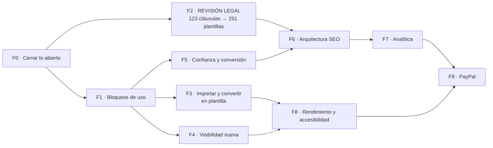

# Plan de implementación final

**SAVE Documentos · SA&VE Comercial, S.R.L. — Punta Cana**
Consolida el plan anterior y los hallazgos de `SAVE-AUDITORIA-INTEGRAL.md`.
5 de septiembre de 2026 · Sustituye a `11-PLAN-DE-IMPLEMENTACION.md`

---

## La idea que ordena todo el plan

El producto funciona. Lo que falta está alrededor. Y hay **dos relojes distintos** que conviene no confundir:

- **Tiempo de abogada:** revisar 123 cláusulas y 251 plantillas. No se acelera escribiendo código, no se puede delegar y es lo más largo de todo el plan.
- **Tiempo de desarrollo:** todo lo demás.

**Corren en paralelo.** El error caro sería tratarlos como una secuencia y quedarse esperando. Mientras la revisión legal avanza, el desarrollo tiene semanas de trabajo útil por delante — y una de esas piezas, la importación de documentos, es precisamente la que hace que el producto sirva **mientras** el catálogo sigue sin aprobarse.



**El camino crítico hacia la adquisición orgánica es F2 → F6 → F7.** Todo lo demás puede adelantarse o retrasarse sin mover esa fecha.

---

## Los tres planes

Decidido el 5 de septiembre. Cierra D1, D2 y D4.

| | **Gratis** | **Pro** · RD$999/mes | **Equipo** · RD$1,699/mes |
|---|---|---|---|
| Plantillas del catálogo | 50 | Las 251 | Las 251 |
| Documentos al mes | 5 | 30 | Sin tope |
| Bóveda | 10 | 30 | 100, y +30 por integrante adicional |
| Crear plantilla desde un documento | — | Sí | Sí |
| Despacho con equipo | — | — | Sí |
| Usuarios | 1 | 1 | Titular + 2 incluidos |
| Usuario adicional | — | — | RD$399/mes |

**Cómo se cuenta la bóveda de Equipo.** Los 100 ya cubren al titular y a los dos
incluidos. El cuarto integrante sube el tope a 130, el quinto a 160, y así.
La bóveda se cuenta **por despacho, no por persona** — y eso ahorra trabajo real:
los archivos ya se guardan en `{org_id}/`, así que no hay que cambiar la
convención de rutas ni mover nada de lo subido.

**Las 50 plantillas del plan gratis** se calculan solas: las más usadas por número
de documentos generados, recalculadas cada semana. **Con una salvedad para el
arranque**, porque hoy hay cero documentos generados y un ranking sin datos sale
vacío: mientras una plantilla no tenga uso, el desempate es por categoría, las
mejores de cada una de las once en rotación. Así el escaparate gratuito cubre
todas las categorías desde el primer día en vez de ser cincuenta contratos de
vehículos, y en cuanto haya uso real el ranking lo corrige solo.

**La asimetría de los dos defaults, que es deliberada:**

- **Documentos:** todo el despacho los ve, salvo que el autor los marque privados.
- **Bóveda:** nadie los ve, salvo que el autor los marque visibles para el despacho.

Son defaults opuestos a propósito. La bóveda es el archivo de originales
sensibles —cédulas, títulos, poderes firmados—; los documentos son el trabajo en
curso del despacho. Hay que **contárselo así al usuario** en la interfaz: si no,
alguien subirá algo dando por hecho que se comporta como lo otro.

**Y lo que hay que saber antes de estimar nada:** hoy **ningún límite se aplica**.
`free_limit` y `vault_limit` existen en la tabla y se pintan en pantalla, pero
solo la bóveda comprueba el suyo. No hay tope de documentos de ninguna clase, ni
control de qué plantillas ve cada plan. Los tres planes se implementan desde
cero; no es ajustar números existentes.

---

## Cómo se lee cada tarea

Cada una lleva **qué**, **por qué**, **dónde** y **cuándo está hecha**. Ese último campo es el que importa: una tarea no está hecha porque exista el código, sino porque se comprobó que hace lo que decía. Los tiempos son estimaciones gruesas de una persona desarrollando.

---

# FASE 0 · Cerrar lo abierto

> ## ✅ CERRADA · 5 de septiembre de 2026
>
> Las tres tareas hechas y comprobadas. Con esto **no queda ningún problema
> crítico abierto** en el proyecto.

**Lo que costó de verdad:** una hora, más un fallo que apareció por el camino
y que merece quedar escrito (ver 0.2).

### 0.1 Rotar las dos credenciales expuestas · P0 · 👤

**Qué.** Cambiar la contraseña del buzón de Hostinger y la contraseña de aplicación, y reescribir la configuración SMTP completa en Supabase.

**Por qué.** Las dos quedaron en texto plano durante el proyecto. Es el único riesgo de seguridad realmente abierto.

**Ojo con esto:** un PATCH parcial a `/config/auth` de Supabase **borra** el campo en vez de actualizarlo. Hay que reenviar el bloque entero. `scripts/configurar-smtp-supabase.ps1` ya lo hace bien.

**Hecho cuando:** un registro de prueba recibe su correo de confirmación con las credenciales nuevas.

**✅ Hecho el 5 de septiembre.** Credenciales rotadas y SMTP funcionando.

### 0.2 Verificar robots.txt y sitemap.xml en el dominio

**Qué.** Comprobar que los dos responden 200 en producción.

**Por qué.** Se generan en el build. Existen en el repositorio, pero eso no es lo mismo que existir en el dominio.

**Hecho cuando:** `savedocumentos.com/robots.txt` menciona el sitemap y `savedocumentos.com/sitemap.xml` contiene la portada.

**✅ Hecho el 5 de septiembre — y aquí apareció un fallo que valida la tarea.**

Los dos seguían devolviendo 404 **con el código ya subido a origin**. No era
falta de despliegue: `/login` tampoco traía el `noindex` del mismo commit, lo
que descartaba a Railway y señalaba al build.

La causa: `robots.ts` y `sitemap.ts` importaban `getSiteUrlEstatico` desde
`lib/siteUrl.ts`, y ese archivo empieza con `import { headers } from 'next/headers'`.
Los dos son **rutas estáticas** —Next las genera en el build, cuando no existe
ninguna petición que tenga cabeceras—, así que arrastrar `next/headers`, aunque
sea de rebote, las rompe. La versión sin cabeceras se mudó a `lib/dominio.ts`,
que no importa nada de Next.

**La lección, que es el motivo de que esta tarea exista:** el código estaba
escrito, revisado y subido, y no estaba hecho. Sin comprobarlo contra el dominio
habríamos dado por buenos dos archivos que no existían.

### 0.3 Cerrar la prueba de privacidad de documentos

**Qué.** Quitar el compartir del documento de prueba y recargar como paralegal.

**Por qué.** Es lo único del modelo de privacidad que está verificado sobre PostgreSQL pero no en producción. Con un solo documento compartido, ver uno no demuestra nada.

**Hecho cuando:** el documento desaparece de la lista del paralegal.

**✅ Hecho el 5 de septiembre.** Quitado el compartir, el paralegal —dentro del
mismo despacho, con la cabecera diciendo "Despacho de elianastephania…"— pasó a
ver **cero documentos**. El documento existe y es del despacho; no lo ve porque
nadie se lo compartió. Privacidad probada por los dos lados.

> Esta prueba pierde sentido cuando entre F4, que invierte el modelo. **Hacerla antes.**

---

# FASE 1 · Bloqueos de uso

**Lo que hoy impide usar el producto con normalidad. Estimado: 1 semana.**

### 1.1 Menú de navegación en móvil · P1

**Qué.** Menú hamburguesa para el área privada por debajo de 768 px.

**Por qué.** El `<aside>` es `hidden md:block`: en un teléfono **desaparece y no hay sustituto**. Quien entre a `/app/documents` no puede llegar a Plantillas, Bóveda ni Mi Despacho salvo escribiendo la URL a mano.

**Dónde.** `src/app/app/layout.tsx`, `src/components/ui/AppNav.tsx`

**Hecho cuando:** a 375 px se puede llegar a las seis secciones sin tocar la barra de direcciones.

### 1.2 Buscador y paginación en Plantillas · P2

**Qué.** Campo de búsqueda por título y categoría, y paginación o carga progresiva.

**Por qué.** 251 tarjetas de golpe son 7.147 nodos en el árbol. En un teléfono pesa, y encontrar una plantilla concreta obliga a recorrerlas todas. `ClausesClient` ya tiene un buscador que sirve de modelo.

**Dónde.** `src/app/app/templates/TemplatesClient.tsx`

**Hecho cuando:** escribir "alquiler" deja a la vista solo las de alquiler, y la página monta menos de 2.000 nodos.

### 1.3 Aplicar los tres planes · P1

**Qué.** Que los límites de la tabla de arriba se cumplan de verdad.

**Por qué.** Hoy no se aplica ninguno salvo el de la bóveda. Un despacho en
Equipo pagando RD$1,699 tiene exactamente las mismas restricciones que uno
gratuito: ninguna.

**Las cuatro piezas:**

1. **Tope mensual de documentos.** No hace falta columna nueva ni contador que
   mantener: se cuenta `documents` con `created_at >= date_trunc('month', now())`
   para ese despacho. Un contador guardado se desincroniza; una consulta, no.
2. **Cupo de bóveda por plan**, con la fórmula de Equipo: `100 + 30 × (integrantes − 3)`,
   con suelo en 100.
3. **Las 50 plantillas del gratis.** Columna `es_gratuita` en `templates`, mantenida
   por una función que se recalcula cada semana, y la política de lectura del
   catálogo la respeta.
4. **Importar solo desde Pro** (ver Fase 3).

**Dónde.** `src/lib/billing.ts`, migración sobre `organizations`, políticas de
`templates`, `src/app/app/documents/new/`, `src/app/app/vault/actions.ts`

**Hecho cuando:** una cuenta gratuita genera cinco documentos y el sexto se
detiene con un mensaje que explica por qué y qué hacer; y un despacho de cuatro
personas ve 130 de cupo en la bóveda, no 100.

### 1.4 La bóveda: privada por defecto · P1 · ✅ decidido

**Qué.** Cada archivo nace privado. Su dueño decide si lo hace visible para el
despacho.

**Por qué.** Hoy las políticas del bucket aíslan por `org_id` y nada más: **todos
los miembros ven todo lo que suba cualquiera**. No se nota porque está vacía; en
cuanto se suban archivos, sí.

**Lo que NO hay que hacer, y conviene dejarlo escrito:** no hay que cambiar la
convención de rutas. Al contarse por despacho y no por persona, `{org_id}/archivo`
sigue sirviendo. Se añade una columna de propiedad y visibilidad, y las políticas
la consultan. Media jornada menos de la que estaba estimada.

**Dónde.** `supabase/migrations/20260822000001_vault_storage_bucket.sql`,
`src/app/app/vault/`

**Hecho cuando:** un paralegal sube un archivo, su compañero no lo ve, y al
marcarlo visible aparece.

### 1.5 Textos que contradicen al producto · P2

**Qué.** Corregir *"Debe tener ya una cuenta en Save Documentos"* en Mi Despacho.

**Por qué.** Desde la Fase 1 se puede invitar a alguien sin cuenta y la crea él. El texto dice lo contrario y hace que no se use una función que ya existe.

**Dónde.** `src/app/app/settings/SettingsClient.tsx`

**Hecho cuando:** el texto describe el comportamiento real.

### 1.6 Pedir el nombre a quien llega invitado · P3

**Qué.** Que `/definir-password` pida nombre y apellido junto con la contraseña.

**Por qué.** Sin nombre, el botón de compartir dice *"Compartir con stephaniamontero84+prueba2@gmail.com"* en vez de *"Compartir con Juana Martínez"*, que es como se pidió.

**Dónde.** `src/app/definir-password/`

**Hecho cuando:** el panel de compartir muestra nombres.

### 1.7 `middleware.ts` → `proxy.ts` · P3

**Qué.** La migración de nombre que Next 16 pide. Aplazada desde la Fase 0 por decisión propia.

**Se hace junto con 8.1**, que toca el mismo archivo.

---

# FASE 2 · Revisión legal del catálogo

**El camino crítico. Tiempo de abogada, no de desarrollo. Estimado: 3 a 6 semanas.**

> **El orden no es negociable: primero las 123 cláusulas, después las 251 plantillas.** `quality.ts` impide publicar una plantilla maestra si alguna de sus cláusulas sigue en borrador. Al revés, las plantillas rebotan una por una.

### 2.1 Dar de alta a la abogada

**Qué.** Que `legalcifuentes@gmail.com` se registre.

**Por qué.** La migración `20260902000000` ya dejó su permiso apuntado por correo. El trigger enlaza la cuenta sola al registrarse.

**Hecho cuando:** entra y ve "Revisión" en el menú, con el contador en 0 de 251 y 0 de 123.

### 2.2 Aprobar las 123 cláusulas

**Qué.** Leer, corregir donde haga falta y aprobar. La pantalla permite editar el texto sin salir.

**Ritmo realista:** entre 15 y 30 al día sin que la calidad se resienta. Entre cinco y ocho jornadas.

**Hecho cuando:** el contador de cláusulas llega a 123.

### 2.3 Aprobar las 251 plantillas

**Qué.** Igual, ya sin bloqueantes de variables ni de cláusulas.

**Por qué importa el orden:** solo cuando 2.2 esté cerrada desaparece el bloqueante *"N cláusulas siguen en borrador"*.

**Hecho cuando:** el número de la portada deja de decir "estamos terminando de revisar el catálogo" y empieza a contar. Ese contador ya está puesto y sube solo.

### 2.4 Estado RECHAZADA · P2

**Qué.** Un estado para lo que la abogada descarta, con motivo.

**Por qué.** Hoy solo se usan DRAFT y PUBLISHED. Una plantilla mala se queda en borrador, **indistinguible de una que nadie ha mirado todavía**. Con 251 por revisar, esa diferencia se pierde enseguida.

**Cómo.** Usar `ARCHIVED`, que ya está en el enum, más una columna de motivo.

**Hecho cuando:** se puede rechazar con motivo y el rechazado no vuelve a aparecer en la cola.

### 2.5 Limpieza del catálogo · P3

- Renombrar `dia_pago` o `dias_pago`: significan cosas distintas y están a un carácter.
- Revisar *"Depósito de garantía"* y *"Depósito en garantía"*.
- Normalizar los saltos de línea: 8 retornos de carro por documento, herencia del CRLF de Windows.

---

# FASE 3 · Importar documentos y convertirlos en plantillas

**Estimado: 2 a 3 semanas. Va aquí por una razón concreta.**

Mientras la abogada revisa, un cliente nuevo entra y **ve un catálogo vacío**. Son semanas de producto inservible. Pero si puede subir el contrato que ya usa y convertirlo en plantilla, SAVE le sirve desde el primer día **sin depender de la revisión legal** — y además es la propuesta de valor que la propia portada anuncia: *"Cualquier documento que repitas puede volverse una plantilla."*

Hoy esa frase no es cierta. Esta fase la hace cierta.

### 3.1 Subir e interpretar el documento

**Qué.** Aceptar `.docx` y pegado de texto plano, y extraer el contenido.

**Cómo.** Un `.docx` es un ZIP con `word/document.xml` dentro. `jszip` ya está en el proyecto para exportar; sirve igual para leer. **Sin dependencias nuevas.**

**Dónde.** `src/lib/engine/import.ts` (nuevo)

**Hecho cuando:** se sube un contrato real y sale su texto con los párrafos separados.

### 3.2 Detectar candidatos a variable

**Qué.** Proponer qué partes del texto deberían ser variables.

**Qué buscar**, y aquí el motor dominicano que ya existe hace casi todo:
- Cédulas con el formato `000-0000000-0` → `validateCedula` ya las valida
- RNC → `validateRNC`
- Montos en RD$ o US$ → `montoALetras` ya sabe convertirlos
- Fechas
- Nombres en mayúsculas sostenidas, típicos de los comparecientes
- Cualquier texto que se repita idéntico tres veces o más

**El diseño que importa:** la detección **propone**, no decide. La persona confirma cada una, le pone nombre y elige si reutiliza una variable del diccionario de 100 que ya existe o crea una nueva. Un importador que decide solo produce plantillas que nadie entiende.

**Dónde.** `src/lib/engine/import.ts`, `src/lib/engine/dominican.ts` (reutilizar)

**Hecho cuando:** sobre un contrato de alquiler real, propone al menos las cédulas, el precio y las fechas, y ninguna propuesta falsa evidente.

### 3.3 Pantalla de conversión

**Qué.** El texto a la izquierda, las variables propuestas a la derecha, y confirmar una por una.

**Dónde.** `src/app/app/templates/importar/` (nuevo)

**Hecho cuando:** de un `.docx` sale una plantilla del despacho, con su formulario, y genera un documento correcto.

### 3.4 Enganchar con el diccionario existente

**Qué.** Que al confirmar una variable ofrezca primero las 100 que ya existen.

**Por qué.** Si cada importación crea `nombre_comprador`, `comprador_nombre` y `nombre_del_comprador`, el diccionario se vuelve inútil en un mes. Es exactamente el problema que la auditoría pedía evitar.

**Hecho cuando:** importar dos contratos parecidos reutiliza variables en vez de duplicarlas.

### 3.5 Restringir a Pro y Equipo

**Qué.** La importación es de pago. Crear plantillas **a mano**, desde cero, sigue
disponible en el plan gratuito.

**Por qué.** Es lo que separa Pro del gratis en la tabla de planes, junto con el
catálogo completo. Y la distinción es limpia de explicar: gratis puedes escribir
una plantilla; pagando, conviertes la que ya tienes.

---

# FASE 4 · El modelo de visibilidad nuevo

**Estimado: 3 a 4 días. Decidido el 4 de septiembre.**

**Invierte** el modelo construido el 1 de septiembre. Antes: cada uno ve lo suyo, más lo que le compartan. Ahora: **todo el despacho ve todo, salvo lo que su autor marque como privado.**

### 4.1 La migración, con su línea delicada

```sql
ALTER TABLE documents ADD COLUMN es_privado BOOLEAN NOT NULL DEFAULT false;

-- Lo que ya existe se creó bajo la promesa de que solo lo veía su autor.
UPDATE documents SET es_privado = true;
```

**Ese `UPDATE` es una línea y sin él, el día del despliegue, todo el despacho vería documentos escritos creyendo que eran privados.** De ahí en adelante, lo nuevo nace visible y quien quiera lo marca.

### 4.2 Política de lectura

`documents_select` vuelve a admitir a los miembros del despacho, **excepto** cuando `es_privado = true` y quien mira no es ni el autor, ni el titular, ni alguien con quien se compartió expresamente.

**Se aprovecha lo que ya está construido:** `document_shares` y las tres funciones `SECURITY DEFINER` no se tiran. Cambian de sentido — de "conceder acceso" a "dar acceso a un documento privado" — y la trampa de recursión que resolvieron sigue resuelta.

**Dónde.** Migración nueva, apoyada en `20260901000000_documentos_privados_y_compartir.sql`

### 4.3 Interfaz

- Interruptor **Privado** en la vista del documento, solo para el autor y el titular
- El botón Compartir aparece **solo** en los documentos privados: en los demás no hay nada que compartir
- Indicador visible de que un documento es privado, en la lista y en el detalle

### 4.4 Volver a probarlo entero

**Qué.** Rehacer sobre el modelo nuevo la prueba de los tres perfiles: titular, y dos paralegales.

**Hecho cuando:** un paralegal ve los documentos normales de su compañero, **no** ve los privados, y sí ve el privado que le compartieron.

---

# FASE 5 · Confianza y conversión

**Estimado: 1 a 2 semanas, la mayor parte redacción.**

Para un producto legal que guarda cédulas y domicilios ajenos, esto pesa más que cualquier optimización técnica. Hoy **no existe ninguna de estas páginas** y la portada solo enlaza a registro, login y un ancla.

### 5.1 Las cuatro páginas que faltan · P1

| Página | Por qué |
|---|---|
| **Términos de servicio** | Ninguna empresa contrata un SaaS sin ellos |
| **Política de privacidad** | El producto almacena datos personales de terceros. No es opcional |
| **Contacto** | Sin forma de contactar no hay confianza ni soporte |
| **Precios** | Hoy no se puede saber lo que cuesta sin registrarse |

**Hecho cuando:** las cuatro están enlazadas desde un pie de página global.

### 5.2 Quiénes somos · P1

**Qué.** Nombre legal —SA&VE Comercial, S.R.L.—, sede en Punta Cana y, cuando el catálogo esté aprobado, quién lo revisó.

**Por qué.** Lo mejor que tiene SAVE en credibilidad **no se está contando**: el sistema **impide** publicar una plantilla maestra sin la firma de un profesional. Eso es exactamente la señal que Google busca en el sector legal, y hoy no aparece en ninguna parte del sitio.

### 5.3 Imagen Open Graph · P1

**Qué.** Una imagen de 1200×630 y su metadata.

**Por qué.** `public/` está vacía: al compartir el enlace por WhatsApp sale una tarjeta en blanco. Para un producto que se recomienda entre profesionales, eso cuesta clics todos los días.

**Nombre del archivo:** `save-documentos-og.png`, en minúsculas y con guiones.

### 5.4 Schema de la portada · P2

Añadir `Organization` —con datos reales— y `FAQPage`, que es legítimo porque las cinco preguntas **están visibles** en la página.

**No se implementa `LocalBusiness`.** SAVE es un SaaS: nadie va a Punta Cana a recoger un contrato. Poner horarios y dirección sería describir un negocio que no funciona así.

### 5.5 El `www` · P2

`www.savedocumentos.com` no resuelve en DNS. Mucha gente lo teclea. Un CNAME y un 301 hacia el dominio sin `www`.

---

# FASE 6 · Arquitectura SEO

**Estimado: 3 a 4 semanas. Depende de F2: sin plantillas aprobadas no hay páginas que publicar.**

Hoy el sitio público es **una página**. Esta es la fase que convierte SAVE en algo que se puede encontrar.

### 6.1 Alinear las categorías · P2

**Qué.** Que la portada lea las categorías de la base en vez de tener diez escritas a mano.

**Por qué.** La portada anuncia diez; la base tiene **once**, con nombres distintos. *Administrativo* y *Personal* no existen en el producto; *Servicios Profesionales*, *Tecnología* y *Marketing* sí existen y no se anuncian.

### 6.2 Página pilar `/plantillas`

Qué es el catálogo, para quién, y las once categorías enlazadas.

### 6.3 Once páginas de cluster `/plantillas/{slug}`

Una por categoría real. Cada una con: H1, un párrafo de qué cubre, **CTA justo después**, la rejilla de plantillas publicadas, "Lo más importante" en cinco puntos, FAQ de tres a cinco preguntas reales, y enlaces al pilar y a dos clusters hermanos.

### 6.4 Hojas de plantilla `/plantillas/{slug-plantilla}`

**Generadas desde la base.** `title`, `description`, categoría y variables ya existen: **no hay que escribir 251 páginas a mano.**

**La regla que protege el proyecto:** una hoja se publica **solo** si su plantilla está `PUBLISHED`. Publicar borradores sería exponer texto jurídico sin revisar y tenderle a Google 251 páginas casi vacías.

### 6.5 Enlazado interno

Migas de pan en las hojas, enlaces a tres plantillas hermanas, y desde cada hoja el CTA transaccional a registro. Ninguna página huérfana, y de la portada a cualquier hoja, tres saltos como mucho.

### 6.6 Sitemap dinámico

```ts
const { data } = await supabase
  .from('templates')
  .select('slug, updated_at')
  .eq('is_master', true)
  .eq('status', 'PUBLISHED')
```

Así **crece solo**, al ritmo que la abogada aprueba, sin volver a desplegar.

---

# FASE 7 · Analítica

**Estimado: 2 días más una acción manual. Depende de F6: medir una sola página da poco.**

### 7.1 GA4 · P1

**Qué.** Instalar GA4 con ocho eventos: `sign_up`, `login`, `template_view`, `template_start`, `document_created`, `document_download`, `document_shared`, `cta_click`.

**Por qué.** `gtag` es `undefined` en producción. No está mal configurado: **no está**. Arrancar adquisición sin medirla es gastar sin saber en qué.

**Ojo:** `NEXT_PUBLIC_GA_ID` se congela en el build. **Hay que redesplegar.**

### 7.2 Search Console · 👤

Propiedad por **prefijo de URL** —no por dominio, que exige DNS y el `www` ni resuelve—, verificación por etiqueta HTML, y enviar `sitemap.xml`.

**Hecho cuando:** a las 48 horas la portada aparece como "Indexada" y el sitemap en estado "Correcto".

### 7.3 Consentimiento de cookies

Si hay tráfico europeo, banner previo a GA4. Hoy no hace falta porque no hay cookies de terceros; en cuanto entre GA4, sí.

---

# FASE 8 · Rendimiento y accesibilidad

**Estimado: 1 semana.**

### 8.1 Restringir el `matcher` del middleware · P2 · el mejor cambio por esfuerzo

**Qué.** Que el middleware cubra solo `/app/*`, `/auth/*` y las pantallas de sesión.

**Por qué.** Hoy corre en **todas** las rutas y llama a `supabase.auth.getUser()` en cada petición. Un visitante anónimo paga una llamada de red a Supabase para ver una página estática — y la portada es justo donde va a aterrizar todo el tráfico orgánico de F6.

**Se aprovecha para hacer 1.7**, el cambio de nombre a `proxy.ts`.

### 8.2 Fuentes con `next/font` · P2

La hoja de Google Fonts bloquea el renderizado. `next/font` la incrusta y quita el salto de tipografía.

### 8.3 Etiquetas de formulario · P2

**Qué.** `id` en cada campo y `htmlFor` en su etiqueta.

**Por qué.** Ningún campo del generador tiene etiqueta asociada. Se ven bien, pero un lector de pantalla dice "campo de edición" dieciocho veces seguidas.

**Dónde.** `src/app/app/documents/new/[templateId]/GeneratorClient.tsx`

### 8.4 Modo oscuro: terminarlo o retirarlo · P2

**Hay que elegir.** Hoy `<html class="light">` está fijo, no hay botón, y **47 archivos** llevan clases `dark:` que no se activan nunca. Es código muerto que se lee, se mantiene y se copia cada vez que se escribe una pantalla nueva.

- **Terminarlo:** botón, clase en `<html>`, `localStorage`, valor inicial desde `prefers-color-scheme` y un script en línea contra el parpadeo. Los 47 archivos ya están escritos: el trabajo real es pequeño.
- **Retirarlo:** quitar las clases y dejar de fingir.

Lo que no conviene es dejarlo como está.

### 8.5 Medir de verdad

Core Web Vitals con PageSpeed Insights **después** de 8.1 y 8.2, no antes. Optimizar sin medir es adivinar.

---

# FASE 9 · PayPal

**Estimado: 1 a 2 semanas. La última, como estaba previsto.**

Va al final porque **cobrar antes de tener qué vender no tiene sentido**: hasta F2 el catálogo está vacío, hasta F5 no hay página de precios y hasta F1.3 el plan de pago no da más capacidad que el gratuito.

### 9.1 Cerrar el modelo de cobro

**Antes de escribir código:** ¿qué incluye cada plan, cuánto cuesta cada asiento adicional, y qué pasa al cancelar con documentos guardados?

`billing.ts` ya tiene RD$999 de base, RD$499 por asiento y un miembro incluido. Falta lo demás.

### 9.2 Integración

- Suscripción con PayPal
- Webhook de pago que actualice `sub_status`
- **La escalada de plan sigue bloqueada desde la aplicación** por `guard_org_plan_columns`: el webhook entra con la llave de servicio, no con sesión de usuario, así que el trigger le deja pasar. Esa pieza ya está resuelta desde la Fase 0.

### 9.3 Estados del ciclo

Pago fallido, periodo de gracia, cancelación y qué ve un despacho con la suscripción vencida. **Nunca borrar documentos por falta de pago**: bloquear la creación de nuevos, no el acceso a lo que ya se pagó.

---

# Resumen de esfuerzo

| Fase | Qué | Estimado | Bloquea a |
|---|---|---|---|
| **F0** | Cerrar lo abierto | ✅ **Cerrada** | — |
| **F1** | Bloqueos de uso | 1 semana | F3, F4, F5 |
| **F2** | Revisión legal | **3–6 semanas · abogada** | **F6** |
| **F3** | Importar y convertir | 2–3 semanas | — |
| **F4** | Visibilidad nueva | 3–4 días | — |
| **F5** | Confianza y conversión | 1–2 semanas | F6 |
| **F6** | Arquitectura SEO | 3–4 semanas | F7 |
| **F7** | Analítica | 2 días + manual | F9 |
| **F8** | Rendimiento y accesibilidad | 1 semana | F9 |
| **F9** | PayPal | 1–2 semanas | — |

**Camino crítico hasta poder hacer adquisición orgánica en serio: F0 → F2 → F6 → F7.** Entre siete y once semanas, y la mitad son de la abogada.

Si F3 y F5 se hacen **en paralelo** con la revisión legal, para cuando el catálogo esté aprobado el producto ya será útil por sí solo y las páginas de confianza ya estarán publicadas. Esa es toda la diferencia entre un plan de tres meses y uno de seis.

---

# Las decisiones

| # | Decisión | Estado |
|---|---|---|
| D1 | Cupos de cada plan | ✅ **Decidido el 5 de septiembre** — ver la tabla de planes |
| D2 | La bóveda, ¿por despacho o por persona? | ✅ **Por despacho**, y privada por defecto |
| D4 | Precios públicos | ✅ **RD$999 Pro · RD$1,699 Equipo · RD$399 por usuario** |
| D3 | Modo oscuro, ¿terminarlo o retirarlo? | ⬜ Abierta · bloquea 8.4 · sin decidir, 47 archivos de código muerto siguen creciendo |
| D5 | Al cancelar, ¿qué pasa con lo guardado? | ⬜ Abierta · bloquea 9.3 · sin definir, que es la peor opción |

**Sobre D5**, para cuando toque: lo que no se puede hacer es borrar documentos por
falta de pago. Lo razonable es bloquear la creación de nuevos y mantener el acceso
y la descarga de lo que ya se pagó. Pero hay que decidir si la bóveda pasa a solo
lectura, cuánto dura el periodo de gracia, y qué ocurre con un despacho de cinco
personas que cae a un plan de una.

# Lo que ya está hecho

No para lucirlo, sino para que no se vuelva a planificar.

| | |
|---|---|
| ✅ | SMTP funcionando y correo de confirmación llegando |
| ✅ | Invitar a un paralegal que todavía no tiene cuenta |
| ✅ | Perfiles Independiente y Paralegal, con lista blanca para liderar despacho |
| ✅ | Blindaje del plan: nadie se lo regala desde la aplicación |
| ✅ | Compartir documentos, con recursión de políticas resuelta |
| ✅ | Pantalla de revisión del catálogo, con permiso propio y estrecho |
| ✅ | El bloqueo que impedía aprobar las 251 plantillas |
| ✅ | `robots.txt`, `sitemap.xml` y `noindex` en las pantallas de autenticación |
| ✅ | El `{"engine":"v2"}` que salía impreso 251 veces |
| ✅ | Contador de la portada que sube solo según se aprueba |
| ✅ | Prueba de dos cuentas del despacho, cerrada en producción |
| ✅ | `robots.txt` y `sitemap.xml` **verificados en el dominio**, no solo escritos |
| ✅ | Credenciales expuestas rotadas: sin problemas críticos abiertos |
| ✅ | Privacidad de documentos probada en producción por los dos lados |
